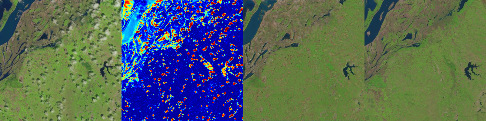
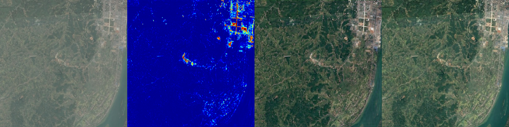
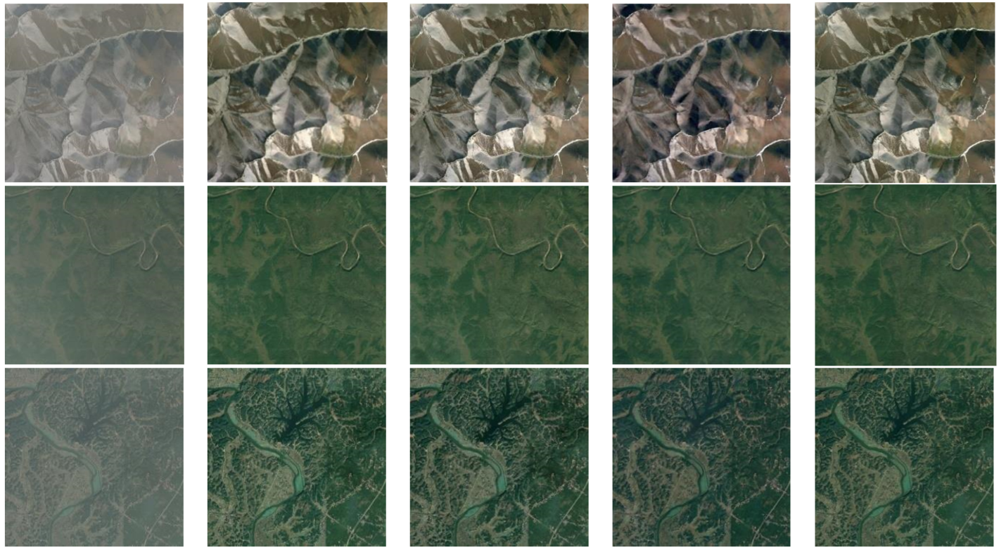

<h1 align="center">Cloud and Fog removal System using GAN</h1>

## 📜 Description:
Optimized ISRO's pre-existing computer vision models to remove clouds and fog from satellite images. Achieved 84% accuracy, enhancing image clarity.

# Sample Demo:
## Demo 1:

## Demo 2:

## Fog Removal Demo:

